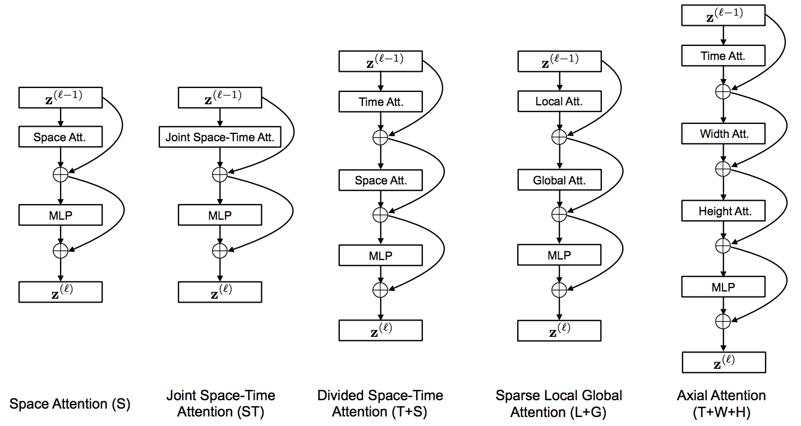

</img>

## TimeSformer - Pytorch

Implementation of <a href="https://arxiv.org/abs/2102.05095">TimeSformer</a>, from Facebook AI. A pure and simple attention-based solution for reaching SOTA on video classification. This repository will only house the best performing variant, 'Divided Space-Time Attention', which is nothing more than attention along the time axis before the spatial.

<a href="https://ai.facebook.com/blog/timesformer-a-new-architecture-for-video-understanding/">Press release</a>

## Install

``` bash
$ pip install timesformer-pytorch
```

## Usage

```python
import torch
from timesformer_pytorch import TimeSformer

model = TimeSformer(
    dim = 512,
    image_size = 224,
    patch_size = 16,
    num_frames = 8,
    num_classes = 10,
    depth = 12,
    heads = 8,
    dim_head =  64,
    attn_dropout = 0.1,
    ff_dropout = 0.1
)

video = torch.randn(2, 8, 3, 224, 224) # (batch x frames x channels x height x width)
mask = torch.ones(2, 8).bool() # (batch x frame) - use a mask if there are variable length videos in the same batch

pred = model(video, mask = mask) # (2, 10)
```

## Citations

```bibtex
@misc{bertasius2021spacetime,
    title   = {Is Space-Time Attention All You Need for Video Understanding?}, 
    author  = {Gedas Bertasius and Heng Wang and Lorenzo Torresani},
    year    = {2021},
    eprint  = {2102.05095},
    archivePrefix = {arXiv},
    primaryClass = {cs.CV}
}
```
